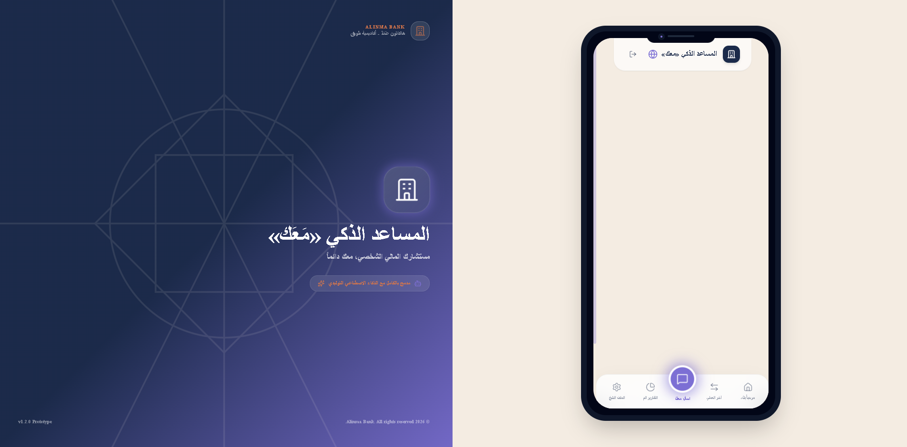
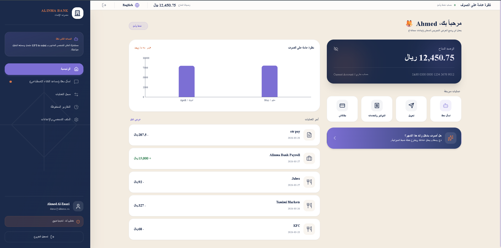
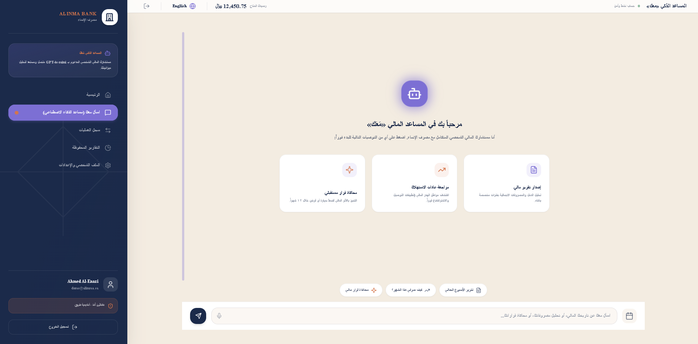

# معك (Ma3ak) — AI-Powered Personal Finance Companion
> **Your personal financial advisor, always with you**  
> **مستشارك المالي الشخصي، معك دائماً**  
> Built for the **Amad Hackathon (هاكاثون أَمَدْ)** by **Tuwaiq Academy**, sponsored by **Alinma Bank**.

[](https://ma3ak-alinma.vercel.app)
&nbsp;


---

## 🖼️ Screenshots · لقطات الشاشة
<!-- Shown once here (shared for both languages) — the UI is language-neutral, so no need to repeat. -->

| Desktop Frame · إطار سطح المكتب | Dashboard · لوحة التحكم |
| :---: | :---: |
|  |  |

**AI Chat — the "Ma3ak" Assistant · المحادثة الذكية «معك»**



<!-- More shots to add later: financial report card (PieChart) and decision simulation card (score gauge + LineChart). -->

---

## 🇬🇧 English Version

### 📖 Project Overview
**Ma3ak (معك — "With You")** is a production-grade personal finance companion integrated into Alinma Bank's mobile application. Powered by advanced artificial intelligence (OpenAI `gpt-4o-mini`), it acts as a proactive advisor that leverages historical client transaction data to perform retrospective audits, evaluate current habits, and forecast the financial consequences of prospective consumer decisions using dynamic simulations.

---

### 🚀 Live Demo
- **Live Application:** **[ma3ak-alinma.vercel.app](https://ma3ak-alinma.vercel.app)**
- **Quickest path:** open the link → tap **"Sign In as Demo User"**.

---

### 🧩 Tech Stack
| Layer | Technologies |
|---|---|
| **Framework** | Next.js 14 (App Router), React 18 |
| **Language** | TypeScript |
| **Styling & UI** | Tailwind CSS, shadcn/ui, Framer Motion |
| **State Management** | Zustand |
| **Artificial Intelligence** | OpenAI `gpt-4o-mini` |
| **Data Layer** | Supabase (PostgreSQL) via `@supabase/supabase-js`, plus an offline `localStorage` mock provider |
| **Charts & Visualization** | Recharts |
| **PDF Export** | jsPDF + html2canvas |
| **Icons** | Lucide React |
| **Deployment** | Vercel |

---

### ✨ Core Features
- 🤖 **AI Financial Advisor (معك):** A conversational assistant embedded in the banking app that understands natural Arabic (including Saudi dialect) and analyzes the customer's real transaction data.
- 📊 **Financial Reports:** On-demand spending reports for any date range, with category breakdowns, an embedded PieChart, and PDF export.
- 🔍 **Spending-Habit Analysis:** A proactive audit of recent behavior (e.g. food-delivery spikes and a broken savings trend).
- 🧮 **Decision Simulation:** Forecasts the impact of major financial decisions (car, loan, travel, etc.) across multiple scenarios with projected balance timelines.
- 🌐 **Bilingual & RTL:** First-class Arabic (RTL) / English (LTR) support with instant switching.
- 📱 **Native-Feel UI:** A mobile-first experience wrapped in a virtual phone frame on desktop.
- 🗄️ **Pluggable Data Layer:** A single-flag switch between an offline mock provider and live Supabase.

---

### 🏗️ Key Technical Architecture Features

#### 1. Bilingual & RTL Directionality (First-Class Arabic Support)
- **Instant Language Swapping:** Dynamic bilingual context switching (عربي / English) with instantaneous document reflowing (`dir="rtl"` vs `dir="ltr"`).
- **Premium Typography:** Integrates Google's `Tajawal` & `IBM Plex Sans Arabic` for a premium Saudi banking font layout, falling back gracefully to system fonts (`Segoe UI`, `Tahoma`) when operating completely offline.

#### 2. Robust Data Abstraction Layer
- Built using a rigorous interface pattern `/src/lib/data/types.ts` that defines a uniform contract `DataProvider`.
- **MockDataProvider:** Uses `localStorage` to handle transactions, user sessions, chat chains, and saved audits. Runs 100% offline with zero dependencies on external connections.
- **SupabaseDataProvider:** Connected using real `@supabase/supabase-js` clients, querying live Postgres tables.
- **Single Config Toggle:** Swap between mock database structures and live Supabase environments by changing `USE_MOCK_DATA = true | false` inside `/src/lib/data/config.ts`.

#### 3. Intelligent AI Chatbot Engine
- Integrated via standard API routes at `/app/api/chat/route.ts`.
- Switched between real OpenAI calls and a simulated engine using `USE_MOCK_AI = true | false` inside `/src/lib/data/config.ts`.
- **Dynamic Seeding & Story-Rich Patterns:** The database seeds 6 months (~200 records) of realistic Saudi transactions (STC Payments, Jarir, Careem, Hungerstation, rent, utility bills, salary deposits of 15,000 SAR) that carry explicit patterns the AI detects:
  1. **Past Reports:** User requests custom date ranges. The system aggregates exact totals, calculates top spending categories, and displays a Recharts PieChart embedded inside the message box.
  2. **Present Habits:** Automatically audits the user's recent cycles, reporting a high food-delivery spike (exceeding 800 SAR/month on Hungerstation & Jahez) and a broken savings trend (the user stopped the usual 2,000 SAR/month savings transfer due to shopping spikes).
  3. **Future Simulation:** Evaluates purchases (e.g. buying a car for 120,000 SAR, an iPhone for 5,000 SAR, or taking a 50,000 SAR loan) across 3 distinct scenarios (Now, Wait 6 Months, Adjusted terms). Computes a 12-month timeline and renders a Recharts LineChart comparing projected balances.

---

### 📁 Project Structure
A high-level map of the major folders (individual files omitted for brevity):
```
src/
├── app/                # Next.js App Router pages + API
│   ├── (screens)       # login, dashboard, chat, reports, transactions, profile
│   └── api/chat/       # AI chat endpoint (mock + OpenAI paths)
├── components/         # Shared UI (Header, BottomNav, ResponsiveFrame)
├── context/            # LanguageContext (AR/EN, RTL/LTR)
├── lib/
│   ├── data/           # Data abstraction: types, config, Mock & Supabase providers
│   └── simulator/      # Decision-simulation engine (manager, modules, utils)
├── locales/            # ar.ts / en.ts translations
└── store/              # Zustand global store
```

---

### ⚙️ Local Installation & Running Instructions

#### Prerequisites
- Node.js (version 18 or 20)
- npm

#### Installation
1. Install dependencies:
   ```bash
   npm install
   ```
2. Start local development server:
   ```bash
   npm run dev
   ```
3. Open [http://localhost:3000](http://localhost:3000) in your web browser.

#### 🔑 Demo Credentials
- **Email:** `demo@alinma.sa`
- **Password:** `Demo1234`
- *(Use the "Sign In as Demo User" button for automatic submission)*

#### 4. Widescreen Responsive Wrapper & Virtual Phone Frame
- **Mobile Fidelity:** Renders as a full-screen, native-feeling mobile app on all mobile and tablet viewports (< 768px).
- **Desktop Virtual Phone Frame:** On larger desktop screens (>= 768px), the entire mobile app is automatically contained inside an elegant mock physical phone device frame (max-width: 420px, height: 90vh, rounded corners, soft backshadows).
- **Branded Desktop Companion Panel:** Beside the phone frame, a premium branded panel is displayed with Alinma + Ma3ak branding, the tagline ("مستشارك المالي الذكي"), Saudi geometric patterns, and a subtle shimmering gradient background using Alinma corporate colors (Navy `#1B2A4A` and Purple `#7C6FD4`).

---

### 🌐 Deployment & Live URLs
- **Live Production Application:** [https://ma3ak-alinma.vercel.app](https://ma3ak-alinma.vercel.app)
- **Repository Visibility:** **Public** — openly available for the hackathon judges and the developer community to review.

---

## 🇸🇦 النسخة العربية

### 📖 نظرة عامة على المشروع
**معك (Ma3ak)** هو نموذج أولى ذو جودة عالية لمساعد مالي شخصي مدمج في تطبيق مصرف الإنماء للهواتف المحمولة. يعمل هذا النظام مدعوماً بالذكاء الاصطناعي (OpenAI `gpt-4o-mini`) ليكون بمثابة مستشار مالي استباقي يحلل سجل العمليات التاريخية للعميل لإعداد تقارير نشاط دقيقة، ومراجعة العادات الاستهلاكية الحالية، والتنبؤ بالعواقب المالية للقرارات المستقبلية باستخدام المحاكاة الديناميكية. تم بناء المشروع لصالح **هاكاثون أَمَدْ** التابع لـ **أكاديمية طويق** برعاية **مصرف الإنماء**.

---

### 🚀 النسخة الحية (Live Demo)
- **رابط التطبيق المباشر:** **[ma3ak-alinma.vercel.app](https://ma3ak-alinma.vercel.app)**
- **أسرع طريقة للتجربة:** افتح الرابط ← اضغط **"الدخول كمستخدم تجريبي"** .

---

### 🧩 التقنيات المستخدمة (Tech Stack)
| الطبقة | التقنيات |
|---|---|
| **إطار العمل** | Next.js 14 (App Router)، React 18 |
| **لغة البرمجة** | TypeScript |
| **التصميم والواجهات** | Tailwind CSS، shadcn/ui، Framer Motion |
| **إدارة الحالة** | Zustand |
| **الذكاء الاصطناعي** | OpenAI `gpt-4o-mini` |
| **طبقة البيانات** | Supabase (PostgreSQL) عبر `@supabase/supabase-js`، إضافة إلى محاكي محلي `localStorage` |
| **الرسوم البيانية** | Recharts |
| **تصدير PDF** | jsPDF + html2canvas |
| **الأيقونات** | Lucide React |
| **النشر** | Vercel |

---

### ✨ المميزات الرئيسية
- 🤖 **المستشار المالي الذكي (معك):** مساعد محادثة مدمج في التطبيق البنكي يفهم اللغة العربية الطبيعية (بما فيها اللهجة السعودية) ويحلل بيانات عمليات العميل الفعلية.
- 📊 **التقارير المالية:** تقارير إنفاق لأي فترة زمنية مع تصنيف الفئات، ورسم بياني دائري مدمج، وتصدير PDF.
- 🔍 **تحليل عادات الصرف:** مراجعة استباقية للسلوك الأخير (مثل ارتفاع صرف التوصيل وتوقّف خطة الادخار).
- 🧮 **محاكاة القرارات:** التنبؤ بأثر القرارات المالية الكبرى (سيارة، قرض، سفر...) عبر عدة سيناريوهات مع مسار متوقّع للرصيد.
- 🌐 **ثنائية اللغة ودعم RTL:** دعم كامل للعربية (RTL) والإنجليزية (LTR) مع تبديل فوري.
- 📱 **تجربة أصيلة:** تصميم للهاتف أولاً، مغلّف بإطار هاتف افتراضي على الحاسب المكتبي.
- 🗄️ **طبقة بيانات مرنة:** تبديل بمتغير واحد بين المحاكي المحلي وقاعدة Supabase الحية.

---

### 🏗️ المميزات التقنية والمعمارية الأساسية

#### ١. دعم ثنائي اللغة والاتجاه (RTL / LTR)
- **تبديل فوري للغة:** نظام تبديل ديناميكي فوري بين العربية والإنجليزية مع إعادة توجيه كامل لاتجاه الصفحة وعناصر واجهة المستخدم.
- **خطوط مخصصة متميزة:** يعتمد على خطوط `Tajawal` و `IBM Plex Sans Arabic` ليعكس الهوية المصرفية السعودية الحديثة، مع دعم كامل للعمل دون اتصال بالإنترنت (Offline Mode) بالاعتماد على الخطوط الافتراضية للنظام مثل `Segoe UI` و `Tahoma`.

#### ٢. طبقة تجريد البيانات المتقدمة (Data Abstraction Layer)
- تم التصميم بالاعتماد على واجهة صارمة (`DataProvider`) معرفة في الملف `/src/lib/data/types.ts`.
- **MockDataProvider:** يعتمد على التخزين المحلي (`localStorage`) لإدارة الجلسات والعمليات وسجلات المحادثة الذكية بشكل كامل ودون اتصال بالإنترنت.
- **SupabaseDataProvider:** يتصل مباشرة بقواعد بيانات Supabase وسيرفرات PostgreSQL الحية.
- **مفتاح تحويل موحد:** يمكنك التبديل بين المحاكي المحلي وقواعد بيانات Supabase الحية عبر تغيير متغير واحد فقط `USE_MOCK_DATA` داخل الملف `/src/lib/data/config.ts`.

#### ٣. محرك المحادثة الذكي لـ «معك»
- يتصل عبر المسار `/app/api/chat/route.ts`.
- يمكن تنشيط OpenAI gpt-4o-mini أو تشغيل المحاكي الذكي عبر تبديل المتغير `USE_MOCK_AI` في ملف الإعدادات.
- **بيانات افتراضية وقصصية غنية:** يتم حقن قاعدة البيانات بـ 6 أشهر من العمليات الممثلة للسوق السعودي (مثل STC pay، جرير، أسواق التميمي والعثيم، هنجرستيشن، جاهز، كريم، سداد الإيجار، الفواتير، وإيداع الراتب في 27 من كل شهر بقيمة 15,000 ريال) مع عادات صرف مدروسة ليتعامل معها المساعد الذكي:
  1. **التقارير السابقة:** يحلل العمليات المالية لأي فترة يحددها العميل ويجمع الرصيد والمصروفات ويعرض رسم بياني دائري (PieChart) مدمج داخل المحادثة.
  2. **العادات الحالية:** يراجع عادات الصرف الحالية وينبه العميل لزيادة صرف التوصيل (أكثر من 800 ريال شهرياً) وتوقف خطته الادخارية (توقف تحويل 2,000 ريال شهرياً بسبب مشتريات جرير والتسوق).
  3. **المحاكاة المستقبلية:** يقارن قرارات الشراء (مثل سيارة بـ 120 ألف، آيفون بـ 5 آلاف، أو قرض بـ 50 ألف) عبر 3 سيناريوهات مختلفة (الآن، الانتظار 6 أشهر، شروط معدلة) ويعرض منحنياً بيانياً (LineChart) متوقعاً للأرصدة لمدة 12 شهراً قادماً.

---

### 📁 هيكل المشروع
خريطة مختصرة للمجلدات الرئيسية (بدون ذكر كل ملف):
```
src/
├── app/                # صفحات Next.js (App Router) + الـ API
│   ├── (الشاشات)       # login, dashboard, chat, reports, transactions, profile
│   └── api/chat/       # مسار المحادثة الذكية (المحاكي + OpenAI)
├── components/         # مكوّنات واجهة مشتركة (Header, BottomNav, ResponsiveFrame)
├── context/            # LanguageContext (عربي/إنجليزي، RTL/LTR)
├── lib/
│   ├── data/           # طبقة تجريد البيانات: types, config, مزوّدا Mock و Supabase
│   └── simulator/      # محرك محاكاة القرارات (manager, modules, utils)
├── locales/            # ملفات الترجمة ar.ts / en.ts
└── store/              # مخزن الحالة العام (Zustand)
```

---

### ⚙️ طريقة التشغيل والتنصيب المحلي

#### المتطلبات
- بيئة تشغيل Node.js (الإصدار 18 أو 20)
- مدير الحزم npm

#### خطوات التشغيل
1. تثبيت الحزم المطلوبة:
   ```bash
   npm install
   ```
2. تشغيل السيرفر المحلي:
   ```bash
   npm run dev
   ```
3. افتح الرابط التالي في المتصفح: [http://localhost:3000](http://localhost:3000).

#### 🔑 معلومات الدخول الافتراضية للجنة التحكيم
- **البريد الإلكتروني:** `demo@alinma.sa`
- **كلمة المرور:** `Demo1234`
- *(استخدم زر "الدخول كمستخدم تجريبي" لتعبئة البيانات تلقائياً)*

#### ٤. إطار الهاتف الافتراضي المستجيب وتصميم سطح المكتب
- **توافق كامل للهواتف المحمولة:** يظهر كـ تطبيق هاتف أصيل ملء الشاشة على كافة أحجام الهواتف والأجهزة اللوحية (< 768px).
- **إطار هاتف تفاعلي متميز:** على الشاشات الكبيرة وأجهزة الكمبيوتر المحمول (>= 768px)، يتم تلقائياً تغليف واجهات التطبيق بالكامل داخل إطار هاتف افتراضي رائع يحاكي الأجهزة الحقيقية (بعرض 420 بكسل وارتفاع 90% مع زوايا دائرية وظلال ناعمة).
- **لوحة الهوية المصرفية التفاعلية:** بجانب إطار الهاتف، يتم عرض لوحة سطح مكتب مخصصة مفعمة بالهوية البصرية لمصرف الإنماء مع شعار "معك"، والعبارة التحفيزية ("مستشارك المالي الذكي")، وزخارف هندسية مستوحاة من التراث السعودي، وخلفية ديناميكية متدرجة الألوان تجمع بين لوني الإنماء (الكحلي `#1B2A4A` والبنفسجي `#7C6FD4`).

---

### 🌐 النشر والروابط الحية للمشروع
- **رابط التطبيق المباشر (Vercel):** [https://ma3ak-alinma.vercel.app](https://ma3ak-alinma.vercel.app)
- **حالة المستودع:** **عام (Public)** — متاح للجنة التحكيم والمطوّرين للاطلاع على الكود ومراجعته.
